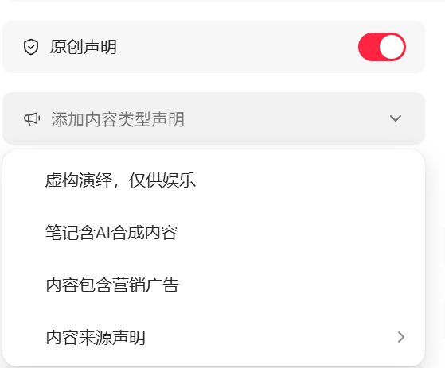
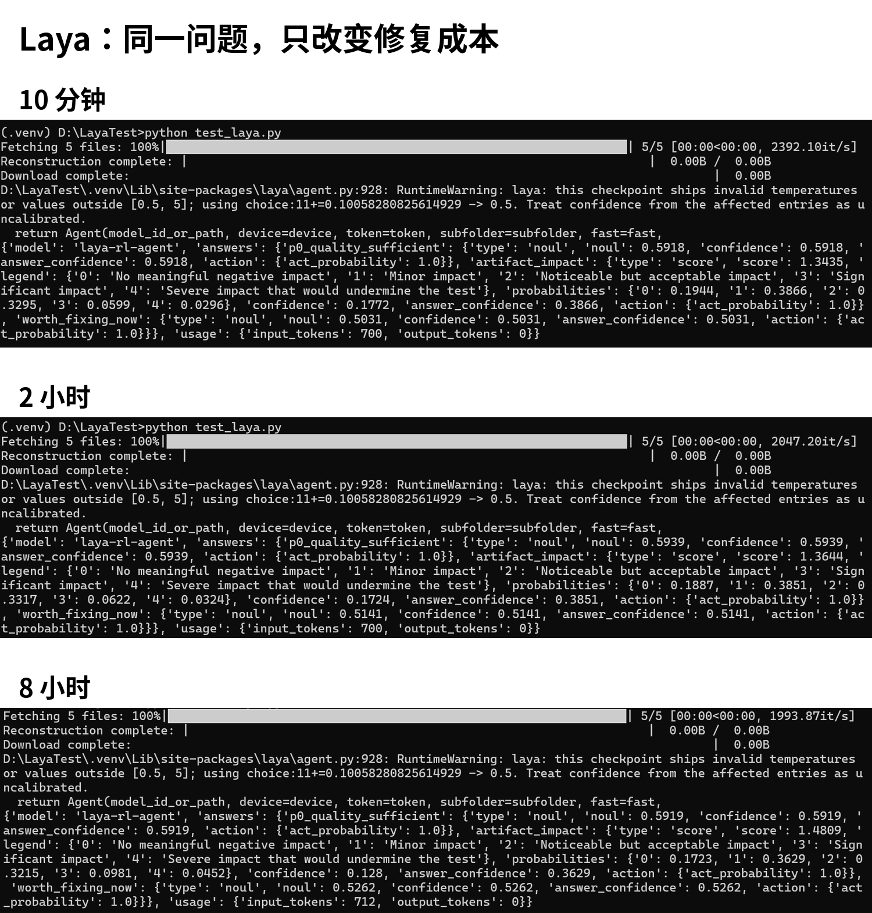

# Jev vs Laya: a small decision-sensitivity case study

> **This is not a rigorous benchmark.** It is a small, controlled experiment note about how two decision-model interfaces responded when one decision-relevant variable changed.

## Background

Jev and Laya both expose structured decision outputs rather than only free-form text. This experiment asks a narrow practical question:

> If the cost of fixing the same visible artifact increases, does the model become less likely to recommend fixing it now?

The scenario came from an early XR / 3D Gaussian Splatting prototype. The reconstruction was already usable for a small user test, but one walkway contained a noticeable artifact.

## Experiment design

The state and questions were kept the same across runs. Only the estimated repair cost changed:

- about 10 minutes of additional capture;
- about 2 hours of additional capture;
- about 8 hours of additional capture and reconstruction work.

Both systems answered three structured questions:

1. Is the reconstruction sufficient for an early P0 XR user test?
2. How much would the walkway artifact affect the test experience? (`score`, 0–4)
3. Given the stated repair cost, is the artifact worth fixing before continuing?

The complete inputs are stored in [`experiment.json`](experiment.json).

## Recorded results

| Repair cost | Jev: worth fixing now | Laya: worth fixing now |
|---|---:|---:|
| 10 minutes | 65% | 50.31% |
| 2 hours | 56% | 51.41% |
| 8 hours | 45% | 52.62% |

The other recorded outputs were:

| Repair cost | Jev: P0 sufficient | Jev: artifact impact | Laya: P0 sufficient | Laya: artifact impact |
|---|---:|---:|---:|---:|
| 10 minutes | 76% | 1.93 / 4 | 59.18% | 1.3435 / 4 |
| 2 hours | 73% | 1.98 / 4 | 59.39% | 1.3644 / 4 |
| 8 hours | 70% | 2.09 / 4 | 59.19% | 1.4809 / 4 |

Original result montages:

| Jev | Laya |
|---|---|
|  |  |

## Interpretation

In these three runs, Jev's `worth_fixing_now` value moved in the expected direction as repair cost increased: **65% → 56% → 45%**. Laya's value stayed near 50% and moved slightly in the opposite direction: **50.31% → 51.41% → 52.62%**.

The narrow conclusion is therefore:

> In this case, Jev showed more intuitively reasonable sensitivity to the changed cost variable. Laya reproduced the structured output format, but these runs do not support treating its confidence values as reliable decision thresholds.

The artifact-impact score also drifted even though the artifact itself did not change. This suggests possible context leakage: every question could see the repair-cost field even when that field should not have mattered. A production decision function should receive only the state variables relevant to that decision.

## Limitations

- This is one scenario with three cost settings, not a representative benchmark suite.
- Each condition was run once; there are no repeated trials or uncertainty estimates.
- The prompts were not independently validated.
- The two systems may differ in model version, calibration method, inference settings, or runtime behavior.
- The tested Laya checkpoint emitted a runtime warning stating that affected confidence values should be treated as uncalibrated because invalid temperature values were replaced.
- The results do **not** establish that Jev is generally better than Laya.

## Reproduce the Laya runs

The original local test used Python 3.11 and `laya==0.3.20` with the `typed-decisions` checkpoint.

```bash
python -m venv .venv

# Windows
.venv\Scripts\activate

# macOS / Linux
source .venv/bin/activate

python -m pip install -r requirements.txt
python test_laya.py --condition 10min
python test_laya.py --condition 2h
python test_laya.py --condition 8h
```

The first run downloads the model checkpoint from Hugging Face and may take some time. The script prints the raw model response. Compare it with the recorded values in `experiment.json`; model or dependency updates may produce different outputs.

Jev was run through its hosted playground with the same state and question JSON. This repository does not automate that hosted service.

## Repository contents

```text
.
├── README.md
├── experiment.json
├── requirements.txt
├── test_laya.py
└── results/
    ├── jev_cost_sensitivity.png
    ├── laya_cost_sensitivity.png
    └── results.json
```

